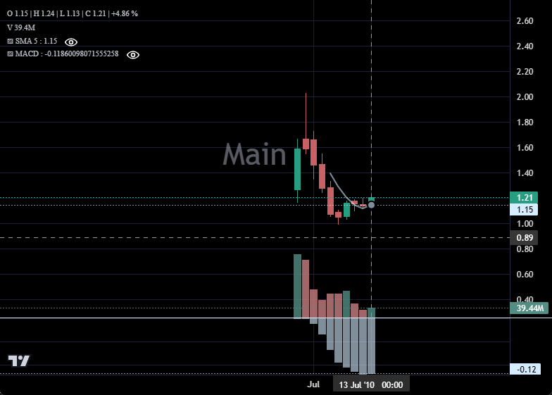

# Panes

Multi-pane charts are created by passing `pane_index` to series constructors, or
by calling `chart.add_pane()` to explicitly create extra panes.

> **Note:** `create_subchart` has been removed. Use the Panes API described here
> and in the [`Pane` reference](../reference/pane.md).

___

## MACD Sub-Pane

Add a histogram to a second pane using `pane_index=1`:

```python
import pandas as pd
from lightweight_charts import Chart


def calculate_sma(df, period=50):
    return pd.DataFrame({
        'time': df['date'],
        f'SMA {period}': df['close'].rolling(window=period).mean()
    }).dropna()


def calculate_macd(df, short=12, long=26, signal=9):
    short_ema = df['close'].ewm(span=short, adjust=False).mean()
    long_ema  = df['close'].ewm(span=long,  adjust=False).mean()
    macd      = short_ema - long_ema
    sig       = macd.ewm(span=signal, adjust=False).mean()
    return pd.DataFrame({
        'time':      df['date'],
        'MACD':      macd,
        'Signal':    sig,
        'Histogram': macd - sig,
    }).dropna()


if __name__ == '__main__':
    chart = Chart(inner_height=1)
    chart.legend(visible=True)

    df = pd.read_csv('ohlcv.csv')
    chart.set(df)

    line = chart.create_line('SMA 50')
    line.set(calculate_sma(df, 50))

    # ── second pane ──────────────────────────────────────────────────────────
    macd_data = calculate_macd(df)
    histogram = chart.create_histogram('MACD', pane_index=1)
    histogram.set(macd_data[['time', 'MACD', 'Signal', 'Histogram']])
    chart.legend(visible=True, pane_index=1)

    chart.show(block=True)
```



    chart.watermark('1')
    chart2.watermark('2')
    chart3.watermark('3')
    chart4.watermark('4')

    df = pd.read_csv('ohlcv.csv')
    chart.set(df)
    chart2.set(df)
    chart3.set(df)
    chart4.set(df)

    chart.show(block=True)

```
___

## Synced Line Chart

```python
import pandas as pd
from lightweight_charts import Chart

if __name__ == '__main__':
    chart = Chart(inner_width=1, inner_height=0.8)
    chart.time_scale(visible=False)

    chart2 = chart.create_subchart(width=1, height=0.2, sync=True)
    line = chart2.create_line()

    df = pd.read_csv('ohlcv.csv')
    df2 = pd.read_csv('rsi.csv')

    chart.set(df)
    line.set(df2)

    chart.show(block=True)
```
___

## Grid of 4 with maximize buttons

```python
import pandas as pd
from lightweight_charts import Chart

# ascii symbols
FULLSCREEN = '■'
CLOSE = '×'


def on_max(target_chart):
    button = target_chart.topbar['max']
    if button.value == CLOSE:
        [c.resize(0.5, 0.5) for c in charts]
        button.set(FULLSCREEN)
    else:
        for chart in charts:
            width, height = (1, 1) if chart == target_chart else (0, 0)
            chart.resize(width, height)
        button.set(CLOSE)


if __name__ == '__main__':
    main_chart = Chart(inner_width=0.5, inner_height=0.5)
    charts = [
        main_chart,
        main_chart.create_subchart(position='top', width=0.5, height=0.5),
        main_chart.create_subchart(position='left', width=0.5, height=0.5),
        main_chart.create_subchart(position='right', width=0.5, height=0.5),
    ]

    df = pd.read_csv('examples/1_setting_data/ohlcv.csv')
    for i, c in enumerate(charts):
        chart_number = str(i+1)
        c.watermark(chart_number)
        c.topbar.textbox('number', chart_number)
        c.topbar.button('max', FULLSCREEN, False, align='right', func=on_max)
        c.set(df)

    charts[0].show(block=True)
```
