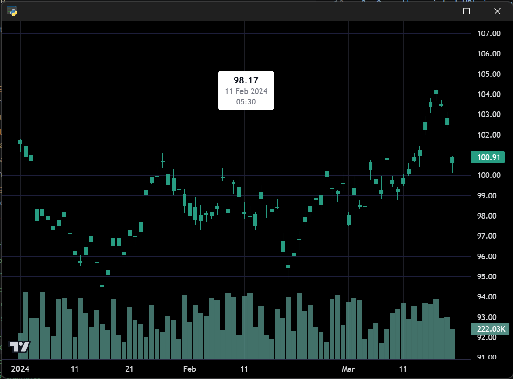

# Tooltip Plugin

Demonstrates the `Tooltip` plugin with tracking mode — the tooltip follows the
crosshair and displays OHLCV values for the bar under the cursor.

**Screenshot**



## Run

```bash
python examples/12_tooltip_plugin/tooltip_plugin.py
```
