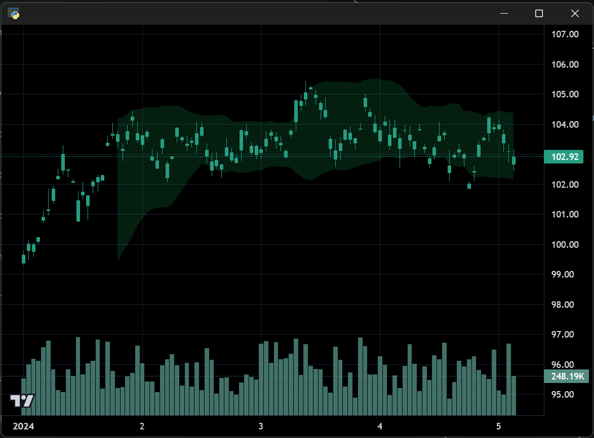

# Bands Indicator

Demonstrates Bollinger Bands visualisation using the `BandsIndicator` plugin to
render a filled envelope between upper and lower band series on a candlestick chart.

**Screenshot**



## Run

```bash
python examples/13_bands_indicator/bands_indicator.py
```
