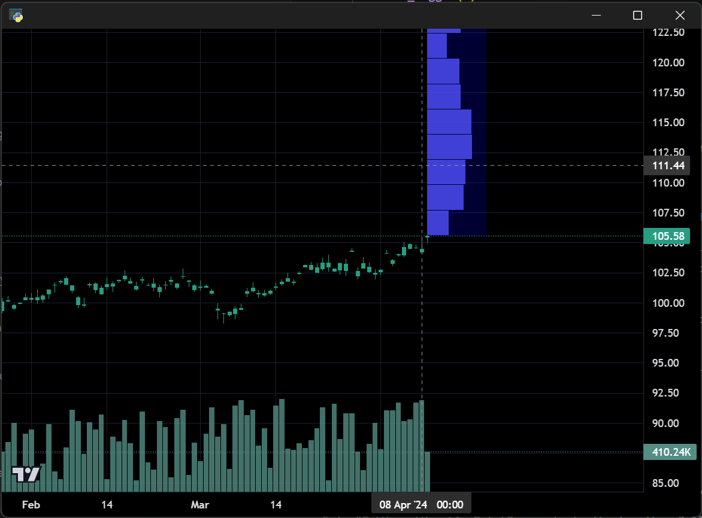

# Volume Profile

Demonstrates the `VolumeProfile` plugin showing a price-level volume distribution
profile anchored at a specific bar, rendered as horizontal bars on the chart.

**Screenshot**



## Run

```bash
python examples/14_volume_profile/volume_profile.py
```
