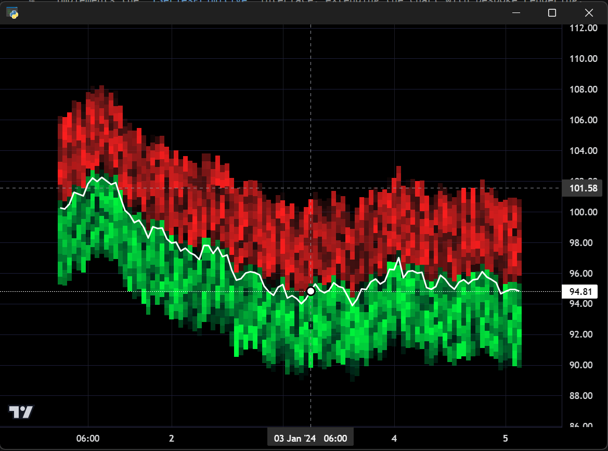

# Heatmap Orderbook

Demonstrates feeding orderbook (bid/ask) data into a `HeatmapSeries` with
per-side colour gradients based on order size to visualise liquidity depth.

**Screenshot**



## Run

```bash
python examples/15_heatmap_orderbook/heatmap_orderbook.py
```
