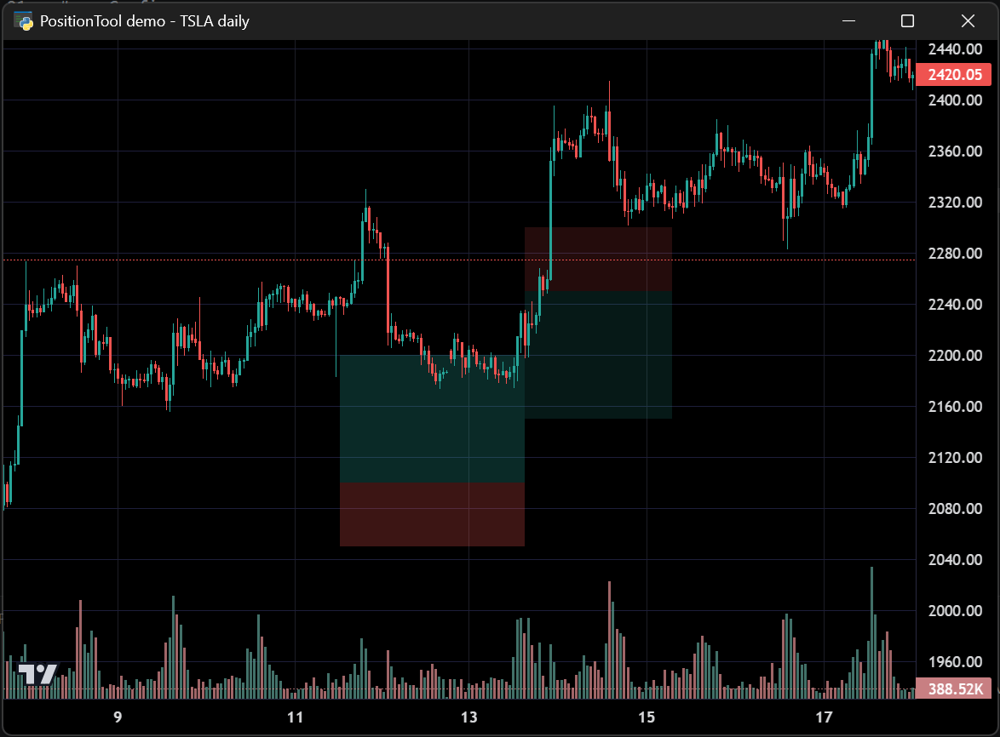

# Positions

Demonstrates the `PositionTool` plugin with historical and live trading positions,
including entry price, stop-loss, and target levels rendered as interactive overlays.

**Screenshot**



## Run

```bash
python examples/16_positions/positions.py
```
