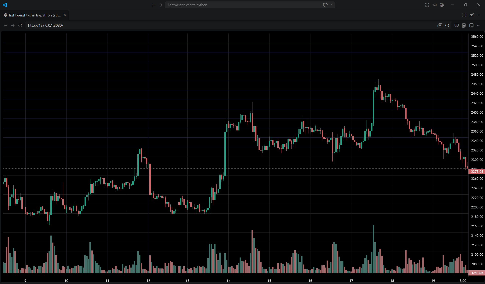

# Stream Chart

Demonstrates `StreamChart` — a chart served over HTTP/WebSocket so any browser can view it.

Instead of opening a desktop window via `pywebview`, `StreamChart` spins up a local
FastAPI/Uvicorn server and streams data to any connected browser tab.

**Screenshot**



## Run

```bash
python examples/17_stream_chart/stream_chart.py
```
