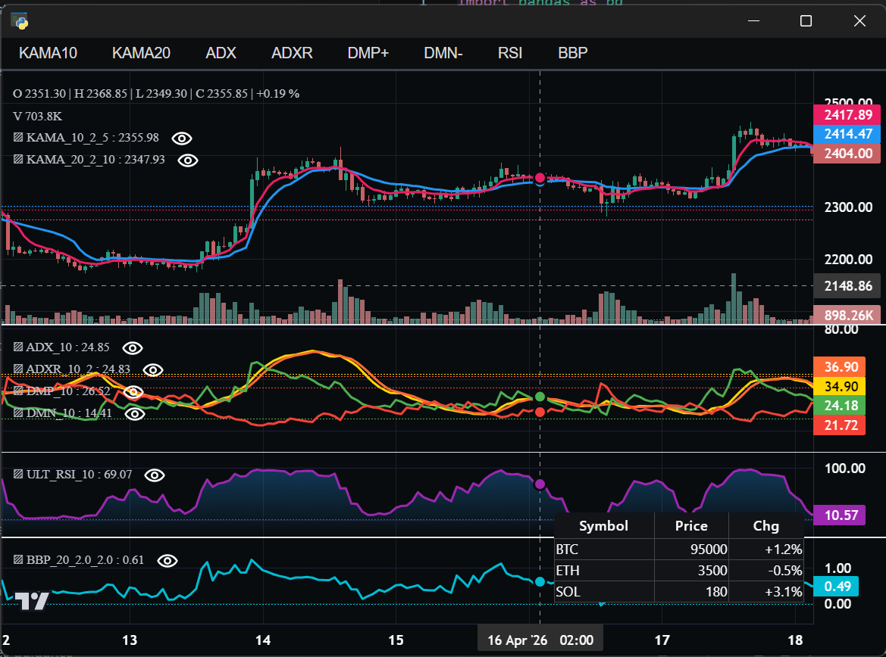

# Full Example

Comprehensive multi-pane example featuring KAMA, ADX, RSI, and Bollinger %B
technical indicators across three panes, plus callbacks, the table widget, and
topbar controls — a complete showcase of the library's capabilities.

**Screenshot**



## Run

```bash
python examples/18_full_example/full_example.py
```
