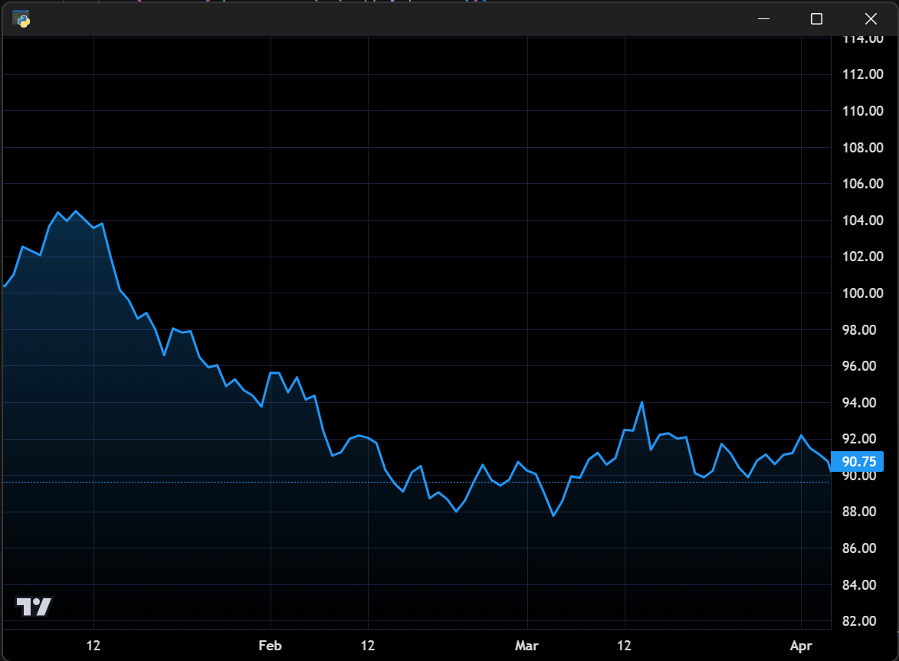

# Area Series

Creates an area chart with gradient fill visualisation of price data, demonstrating
the `Area` series type with custom colours and line width options.

**Screenshot**



## Run

```bash
python examples/9_area_series/area_series.py
```
